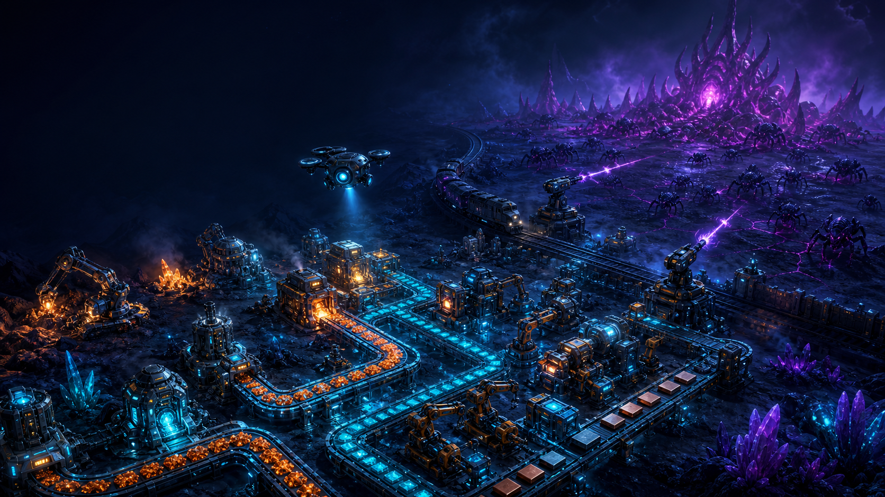

# Asterion Assembly

Construa uma fábrica que sabe quando agir.

Asterion Assembly é um jogo single-player e open source de automação industrial
em um mundo bioluminescente. Controle um engenheiro humanoide, extraia recursos,
organize linhas de produção e transforme estoques, fluidos e energia em uma
fábrica controlada por circuitos.



*Arte conceitual do jogo; não é uma captura de tela.*

> **3.0 em desenvolvimento.** O foco atual é a sequência inicial de seis desafios
> de automação por circuitos. O jogo ainda não é uma versão comercial final;
> balanceamento, testes com jogadores e validação em mais equipamentos continuam
> pendentes. Consulte o [estado do projeto](docs/UPGRADE-3.md).

## Sua fábrica, suas regras

- **Extraia, transporte e produza.** Combine mineradoras, esteiras de duas pistas,
  braços, divisores e máquinas. Veja os itens reais percorrendo a fábrica e
  inspecione estoques, energia e vazão para encontrar gargalos.
- **Automatize com circuitos.** Conecte redes vermelhas e verdes, leia sensores e
  use combinadores para controlar máquinas. Pare um braço quando o estoque
  atingir o limite, regule uma bomba pelo nível do tanque ou acione um alarme.
- **Aprenda construindo.** Os seis desafios iniciais passam por extração,
  energia, controle de estoque, separação de recursos, fluidos e um contador com
  lâmpada e alarme. Os objetivos exigem funcionamento sustentado, não apenas
  construções colocadas no mapa.
- **Explore e expanda.** Mundos por seed, biomas, ruínas, fauna e poluição
  acompanham a progressão tecnológica. Ferrovias, drones e defesas fazem parte
  do conteúdo mais avançado, que continua sendo aprofundado. A campanha permite
  continuar no mesmo mundo em sandbox após a vitória.
- **Jogue no seu ritmo.** Quatro dificuldades, incluindo modo pacífico; pausa e
  velocidades 1×, 2× e 4×; português e inglês; controles remapeáveis, gamepad,
  perfis, saves manuais e três autosaves rotativos.

## Baixar e jogar

Os builds de desenvolvimento para Linux e Windows x64 são empacotados pelo
[GitHub Actions](https://github.com/EdenCompiler/asterion-assembly/actions/workflows/release.yml).
Abra uma execução bem-sucedida e procure os artefatos
`asterion-assembly-linux-x64` ou `asterion-assembly-windows-x64`.

Extraia o ZIP do jogo por inteiro, mantendo o executável junto dos assets e das
bibliotecas. Os pacotes incluem o runtime Lisp e as bibliotecas SDL necessárias;
não é preciso instalar Quicklisp para jogar. É necessária uma GPU/driver com
OpenGL 3.3 ou superior.

- **Linux:** na pasta extraída do jogo, execute `./play.sh`. Se necessário,
  habilite a execução com `chmod +x play.sh asterion-assembly`.
- **Windows:** abra `asterion-assembly.exe` na pasta extraída. Pelo PowerShell,
  entre nessa pasta e execute `.\asterion-assembly.exe`.

Escolha o idioma em **Configurações**. O executável também aceita `--pt` como
preferência inicial e `--safe-mode` para iniciar sem mods; preferências de um
perfil salvo são restauradas ao abrir o jogo.

**Saves:** a versão 3 usa `saves/v3/`. Saves e mods das versões 1/2 são
incompatíveis e recusados sem alteração. Em **Continuar**, escolha o save;
em **Pausa → Salvar**, crie um arquivo manual ou confirme sua sobrescrita.

## Primeiros controles

Estes são os atalhos padrão; altere-os em **Configurações → Controles**.

- `WASD`: mover o engenheiro; clique esquerdo ou arrasto: construir;
  clique direito: remover.
- `Q` / `E`: escolher construção; `R`: girar; `F`: escolher receita antes de
  construir; `Z`: desfazer uma construção recente.
- `I`: abrir o inventário da construção sob o cursor e inserir ou retirar itens.
- `C`: abrir o modo de circuitos; nesse modo, `X` troca a cor do fio e o botão
  direito corta uma conexão.
- `B`: catálogo; `T`: tecnologias; `Tab`: estatísticas ou aba de circuitos.
- `Espaço`: pausa; `F1` / `F2` / `F3`: velocidade da simulação.

No gamepad, o analógico esquerdo move o personagem e o direito move o cursor.
`A` constrói/confirma, `B` remove/cancela, `Y` abre circuitos, `R3` abre o
inventário e `Start` pausa. O [manual do jogador](docs/MANUAL.md) explica os
controles contextuais, a produção e as configurações.

## Mods

Adicione conteúdo e regras pelo [guia de mods](docs/MODDING.md). O repositório
inclui um [mod de exemplo](mods/example-more-belts). Mods com scripts Lisp
executam código confiável, sem sandbox de segurança: instale somente de fontes
em que confia. Mudanças de mods exigem reiniciar o jogo.

## Executar a partir do código

Para desenvolvimento, instale SBCL, Quicklisp, SDL2, SDL2_image e SDL2_mixer.
Na raiz do repositório:

```sh
make run
```

Para escolher a seed e a preferência inicial de idioma:

```sh
sbcl --script run.lisp pt 1701
```

Comandos de desenvolvimento e validação:

```sh
make test                 # testes da simulação e da interface
make playtest             # testes em janelas virtuais
make playtest-first-hour  # jornadas SDL por teclado/mouse e gamepad virtual
make package-linux        # gerar o ZIP Linux
make smoke-package        # empacotar e testar o ZIP Linux
```

Os playtests virtuais usam ferramentas adicionais, incluindo Xvfb, xdotool,
ImageMagick e Openbox. Instruções e limites da validação estão no
[estado do marco 3.0](docs/UPGRADE-3.md) e no
[relatório de playtest](docs/PLAYTEST-3-2026-09-06.md).
O [histórico de mudanças](CHANGELOG.md) acompanha a evolução do jogo.

### Sobre a engine

Asterion Assembly usa **Antigonus**, uma engine Common Lisp macro-dirigida e
reutilizável. Seu único arquivo-fonte é [`antigonus.lisp`](antigonus.lisp);
a implementação interna é em pt-BR e a API pública é em inglês.
A [documentação da API](docs/API.md) apresenta os tipos, macros e operações
para quem deseja criar conteúdo ou outros jogos.

## English

**Build a factory that knows when to act.** Asterion Assembly is an open-source,
single-player factory automation game set in a bioluminescent world. Control a
humanoid engineer, route resources, balance production and wire sensors and
combinators to make your factory react to its own state.

The current 3.0 development milestone focuses on six introductory circuit
challenges. It includes remappable controls, controller input, English and
Portuguese, manual saves and rotating autosaves. This is not a finished
commercial release; human playtesting and broader hardware validation remain
outstanding. Development builds for Linux/Windows x64 are produced by
[GitHub Actions](https://github.com/EdenCompiler/asterion-assembly/actions/workflows/release.yml).
Extract the complete game package and run `play.sh` on Linux or
`asterion-assembly.exe` from its folder on Windows. OpenGL 3.3 is required;
packaged builds do not require Quicklisp. Older version 1/2 saves and mods are
incompatible and are left untouched.

See the bilingual [player manual](docs/MANUAL.md) and [modding guide](docs/MODDING.md).
Antigonus is the reusable engine behind the game; its technical details are in
the [API documentation](docs/API.md).

## Licença / License

Código e dados estão sob [MIT](LICENSE). Code and data are MIT licensed.
O nome e o logotipo têm [aviso separado de marca / separate trademark notice](TRADEMARK.md).
Veja também as [licenças de terceiros / third-party notices](THIRD_PARTY.md).
